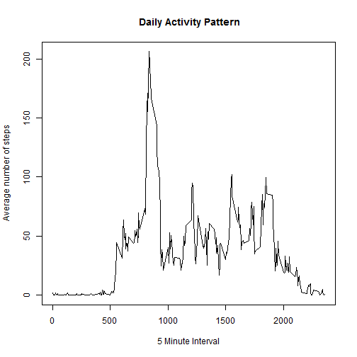
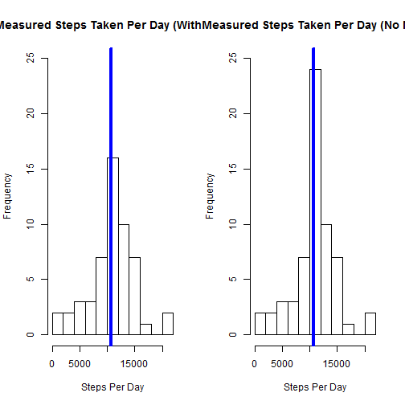

# Personal Activity Data

We have obtained a dataset containing the activity of a single person over the course of two months, October and November.  This data was recorded from a personal activity monitoring device.  

Our goal is to find interesting patterns and behaviors using this data.  We will make use of a question and answer format to find the relevant information.

## Loading and preprocessing the data

First we need to read the data in so we can work with it, then take a summary to see what data we have.
library(ggplot2)


```r
csvFile <- unzip("activity.zip");
activity <- read.csv(csvFile, stringsAsFactors = FALSE);
summary(activity);
```

```
##      steps            date              interval     
##  Min.   :  0.00   Length:17568       Min.   :   0.0  
##  1st Qu.:  0.00   Class :character   1st Qu.: 588.8  
##  Median :  0.00   Mode  :character   Median :1177.5  
##  Mean   : 37.38                      Mean   :1177.5  
##  3rd Qu.: 12.00                      3rd Qu.:1766.2  
##  Max.   :806.00                      Max.   :2355.0  
##  NA's   :2304
```

From the summary we can see that the dates are in character format.  We will change them to date format for easier processing.


```r
activity$date <- as.Date(activity$date);
```

We can also see that there some missing values in the steps taken.  This will be need to be addressed later.

## What is mean total number of steps taken per day?

The first information we want to find is how many steps were taken per day.  We can use a histogram to get a quick and easy insight into how many steps are taken per day, and then we will calculate the specific mean and median steps per day. 

First we will remove the records that are missing data for the steps taken.  Next we will aggregate the steps by day, since the count in the data is in 5-minute intervals.


```r
activityNoNA <- activity[which(!is.na(activity$steps)),];
activityPerDay <- tapply(activityNoNA$steps, activityNoNA$date, sum);
```

Finally we make a histogram of the steps taken, using the aggregated data set above.


```r
hist(activityPerDay, 10, main = "Measured Steps Taken Per Day", xlab = "Steps Per Day");
```


## Mean and Median Per Day

Other intesting information is the mean (average) steps taken per day, as well as the median steps taken per day.  


```r
perDayMean <- mean(activityPerDay);
perDayMedian <- median(activityPerDay);
```

In our data set, the mean is 1.0766189 &times; 10<sup>4</sup>, and the median is 10765.

## What is the average daily activity pattern?

Taking  an average across the entire data set can help us see different interesting information like what time of day is most activity occurring, what time of day is most restful, and so on.

For this information, we will need to aggregate the dataset by time intervals.  A per interval mean is calculated for this, and using that we will create a time series plot.


```r
intervalMeanSteps <- tapply(activityNoNA$steps, activityNoNA$interval, mean);
plot(y = intervalMeanSteps, x = names(intervalMeanSteps), type = "l", xlab = "5 Minute Interval", 
    main = " Daily Activity Pattern", ylab = "Average number of steps");
```



For the plot above, the x-axis represents the time intervales in the dataset.  The names of the intervals correspond to the time of day, so that 500 would be 5:00 AM and 1500 would be 3:00 PM.  These measurements start at 0, which is midnight, and end at 2355, which is 11:55 PM.

Calculating the time interval in which the most steps are taken on average finds 8:35 AM, with 206.1698 steps.


```r
intervalMeanSteps[intervalMeanSteps == max(intervalMeanSteps)];
```

```
##      835 
## 206.1698
```

## Imputing missing values

Missing values can change the way our data looks.  We will make a copy of our original data and add in missing data by using averages and then see how our data has changed.

First let's find how many records contain NAs, which are the missing values.


```r
sum(is.na(activity));
```

```
## [1] 2304
```

Next let's fill in the missing values.  The count of missing records matches the number of missing steps reported from our initial look at the dataset, so we only need to fill in missing steps.  

To fill in the missing data, we will take the mean for the 5-minute interval across the rest of the data and fill it in for the missing values.  We will create a new dataset based on the original data and then fill in the missing values.  The previous means calculated per interval will help here.


```r
activityFilled <- activity;
activityFilled$date <- as.Date(activity$date);
activityFilled[which(is.na(activityFilled$steps)),1] <-
        intervalMeanSteps[as.character(activityFilled[which(is.na(activityFilled$steps)),3])];
```

Next we can re-create the same histogram as above, with the new dataset that does not have missing values.
		

```r
activityPerDayFilled <- tapply(activityFilled$steps, activityFilled$date, sum);

par(mfrow = c(1,2));
hist(activityPerDay,10, main = "Measured Steps Taken Per Day (With NAs)", xlab = "Steps Per Day", ylim = c(0, 25));
abline(v = median(activityPerDay), col = 4, lwd = 4);
hist(activityPerDayFilled, 10, main = "Measured Steps Taken Per Day (No NAs)", xlab = "Steps Per Day", ylim = c(0, 25));
abline(v = median(activityPerDayFilled), col = 4, lwd = 4);
```



## Mean and Median Per Day

Next we will find the mean and median of our new dataset.


```r
perDayMeanFilled <- mean(activityPerDayFilled);
perDayMedianFilled <- median(activityPerDayFilled);
```

In our modified data set, the mean is 1.0766189 &times; 10<sup>4</sup>, and the median is 1.0766189 &times; 10<sup>4</sup>.  This shows that filling in the missing values with the average for each time interval affects the data only minimally.  In the updated histogram, the only value that changed is the average, which shows up more because that's what was used to fill in values.

## Are there differences in activity patterns between weekdays and weekends?

Another intesting piece of information is how activity level changes between weekdsya, when we assume the person being monitored is working, and weekends, when the person is not at work.  

To answer this question, we will create factor variable in the dataset with two levels – “weekday” and “weekend” indicating whether a given date is a weekday or weekend day.


```r
activityFilled$dateType <- ifelse(as.POSIXlt(activityFilled$date)$wday %in% c(0,6), 'weekend', 'weekday');
```

Next we can create a plot to show total steps per day on weekdays as well as weekends.  


```r
aggregateActivityFilled <- aggregate(steps ~ interval + dateType, data=activityFilled, mean);
ggplot(aggregateActivityFilled, aes(interval, steps)) + 
    geom_line() + 
    facet_grid(dateType ~ .) +
    xlab("5-minute interval") + 
    ylab("avarage number of steps");
```

```
## Error in eval(expr, envir, enclos): could not find function "ggplot"
```
